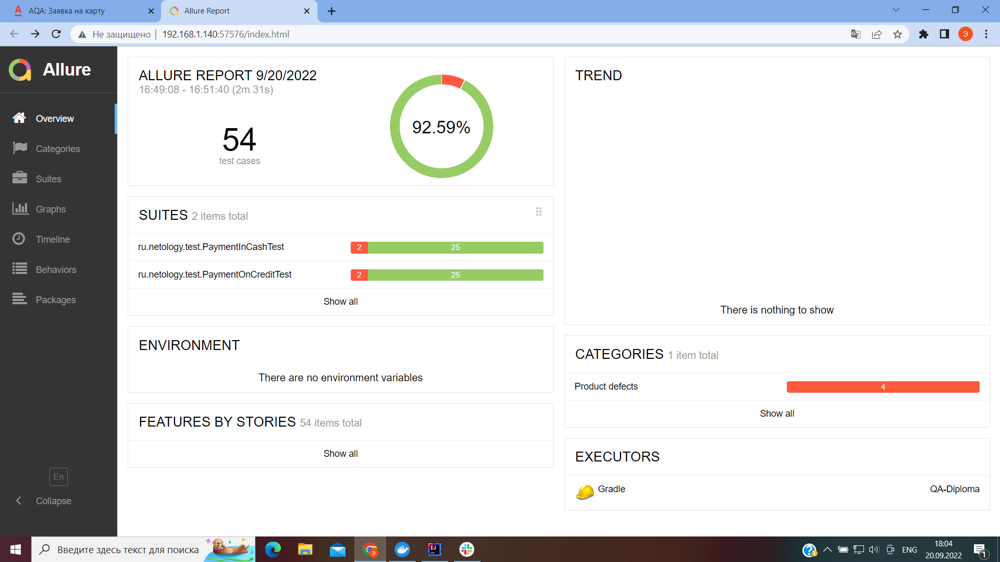

# Отчёт о проведённом тестировании

## Краткое описание
В ходе дипломного проекта произведена автоматизация тестирования комплексного сервиса, взаимодействующего с СУБД и API Банка. Приложение представляло из себя веб-сервис, который предлагал купить тур по определенной цене с помощью двух способов:
- Обычная оплата по дебетовой карте; 
- Уникальная технология: выдача кредита по данным банковской карты.

## Количество тест-кейсов:
Общее количество тест-кейсов - 54 (4 позитивных, 50 негативных):

- Успешных - 50 (92.59%)
- Неуспешных - 4 (7,41%)

***Внимание!!! В негативных сценариях, там где действительно были выявлены "БАГ"-и (пункты №:17 и 18, 31 и 32, 33 и 34, 35 и 36, 37 и 38, 39 и 40, 43 и 44)" или предложения по улучшению, автотесты проверяют фактические результаты, поэтому и проходят (не падают!). Прошу учесть этот момент при дальнейшем анализе Issues и ALLURE REPORT.***

## Общие рекомендации
В результате тестирования были выявлены и заведены следующие Issues ("Баг"-и и предложения по улучшению, при этом автотесты написаны не по всем "Баг"-ам и предложениям по улучшению):
- Issues #1 - [Орфографическая ошибка в названии города на главной странице сервиса.](https://github.com/edgaraga/QA-Diploma/issues/1) ;
- Issues #2 - [Неверный заголовок страницы в браузере.](https://github.com/edgaraga/QA-Diploma/issues/2) ;
- Issues #3 - [Неверная запись информации в БД при покупке тура по данным карты "4444 4444 4444 4441" со статусом APPROVED.](https://github.com/edgaraga/QA-Diploma/issues/3) ;
- Issues #4 - [Одобрение банка при оплате тура картой со статусом DECLINED.](https://github.com/edgaraga/QA-Diploma/issues/4) ;
- Issues #5 - [Одобрение банка при вводе нулевого значения в поле "Месяц" совместно с последующими валидными годами.](https://github.com/edgaraga/QA-Diploma/issues/5) ;
- Issues #6 - [Одобрение банка при вводе в поле "Владелец" только имени или фамилии владельца карты.](https://github.com/edgaraga/QA-Diploma/issues/6) ;
- Issues #7 - [Одобрение банка при вводе в поле "Владелец" только имени или фамилии владельца карты с маленькой буквы.](https://github.com/edgaraga/QA-Diploma/issues/7) ;
- Issues #8 - [Одобрение банка при вводе в поле "Владелец" более 30-и символов на латинице.](https://github.com/edgaraga/QA-Diploma/issues/8) ;
- Issues #9 - [Одобрение банка при вводе в поле "Владелец" одного заглавного латинского символа.](https://github.com/edgaraga/QA-Diploma/issues/9) ;
- Issues #10 - [Одобрение банка при вводе в поле "Владелец" русских букв, чисел и спецсимволов.](https://github.com/edgaraga/QA-Diploma/issues/10) ;
- Issues #11 - [Одобрение банка при вводе нулевого значения в поле "CVC/CVV".](https://github.com/edgaraga/QA-Diploma/issues/11) ;
- Issues #12 - [Предложение по улучшению: убрать лишнее всплывающее окно при отправке формы с номером карты, отсутствующим в базе данных.](https://github.com/edgaraga/QA-Diploma/issues/12) ;
- Issues #13 - [Предложение по улучшению: убрать лишнее сообщение об ошибке при отправке формы с пустым "CVC/CVV".](https://github.com/edgaraga/QA-Diploma/issues/13) ;
- Issues #14 - [Предложение по улучшению: изменить неинформативное сообщение об ошибке под полем "Год" при отправке формы с несуществующим значением "00".](https://github.com/edgaraga/QA-Diploma/issues/14) ;
- Issues #15 - [Предложение по улучшению: изменить неинформативное сообщение об ошибке под полем "Месяц" при отправке формы с истекшим сроком действия карты.](https://github.com/edgaraga/QA-Diploma/issues/15) ;
- Issues #16 - [Предложение по улучшению: убрать лишние сообщения об ошибке у полей "Номер карты", "Владелец" и "CVC/CVV" после ввода валидных данных.](https://github.com/edgaraga/QA-Diploma/issues/16) ;
- Issues #17 - [Предложение по улучшению: изменить неинформативное сообщение об ошибке под полем "CVC/CVV" при отправке формы содержащей менее трех символом.](https://github.com/edgaraga/QA-Diploma/issues/17) ;
- Issues #18 - [Предложение по улучшению: изменить неинформативные сообщения об ошибках, при отправке формы с пустыми полями "Номер карты", "Месяц" и "Год".](https://github.com/edgaraga/QA-Diploma/issues/18) .

## Программное окружение:
- Windows 10, Версия 21H1
- Java version "18.0.2" 2022-07-19
- IntelliJ IDEA 2022.1 (Community Edition)
- Google Chrome, версия 105.0.5195.127 (Официальная сборка), (64 бит)